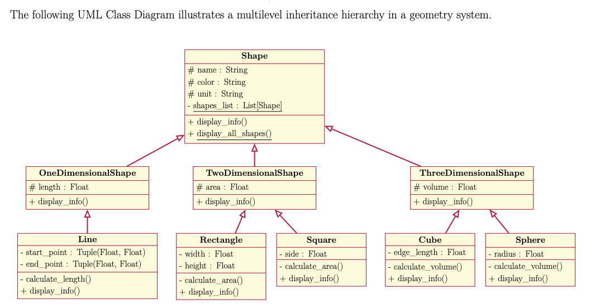

# Classwork: Example in Lecture note

According to the lecture note, follow its instructions to complete the `homework.py` file.



Above is the updated UML diagram. Use it as a reference to implement the code.

## Instructions/Your Task

Implement all the classes as described in the provided UML diagram.


- The text **"Displaying all shapes:"** should be printed inside the `display_all_shapes()` method. All other output is produced polymorphically by calling `display_info()` on each shape object.

- `display_info()` displays all available content up to what it has.


1. **Edit/Modify `homework.py`:**  
   - Ensure that the program outputs match the provided example output.

2. **Run the Script with Test Cases:**  
   - To verify your script against the provided test cases, use the `chk_homework.py` script.  
   - Open your terminal and navigate to the directory containing `chk_homework.py`.  
   - Execute the test script using Python:  
     ```sh
     python chk_homework.py
     ```  
